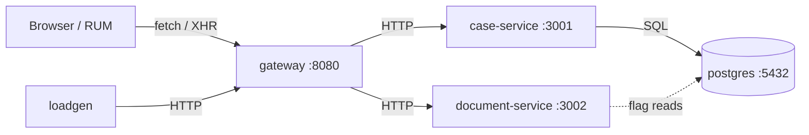

# Overview

This guide walks you through standing up the **Citizen Services Case Management
System** demo on a **single AWS EC2 instance** and monitoring it end-to-end with
**Dynatrace**.

The app is a multi-service `docker-compose` project (a federal case-management
system modeled on Dynatrace EasyTrade). By the end you will have a credible,
accessible public-sector web app running on EC2, fully instrumented by
Dynatrace, with continuous baseline traffic and on-demand failure scenarios you
can use to demonstrate **Davis® AI** root-cause analysis.

!!! warning "This is the host-agent path, not the Operator"
    This guide is adapted from the Kubernetes-based Dynatrace enablement lab at
    <https://dynatrace-wwse.github.io/remote-environment/>. That lab deploys to
    Kubernetes with the **Dynatrace Operator / Dynakube**. **This app is
    `docker-compose`, so the correct monitoring path is OneAgent installed as a
    host agent** on the EC2 instance. There is no Operator, no Dynakube, and no
    Kubernetes anywhere in this guide. OneAgent on the host auto-instruments
    every container and Postgres.

## What you will deploy

Five containers, started by one `docker compose` command:

| Service (compose name) | Container | Host port | Role |
| --- | --- | --- | --- |
| `gateway` | `csa-gateway` | **8080** | Serves the web UI and is a backend-for-frontend. **This is the only port you must expose publicly.** |
| `case-service` | `csa-case-service` | 3001 | Case CRUD, search, dashboard aggregations. Owns the case-domain SQL. |
| `document-service` | `csa-document-service` | 3002 | Document validation / processing. CPU-bound work. |
| `postgres` | `csa-postgres` | 5432 | PostgreSQL 16, seeded with ~300 cases on first start. |
| `loadgen` | `csa-loadgen` | — | Continuous baseline traffic; auto-starts. |

!!! note "Ports 3001 / 3002 / 5432"
    The compose file publishes these on the host for convenience/debugging, but
    the application only needs **8080** to be reachable. You will **not** open
    3001/3002/5432 in the AWS security group — keep them private.

## Architecture & trace flow

A browser action calls the gateway, which fans out over HTTP to `case-service`
and/or `document-service`; `case-service` queries Postgres. With OneAgent on the
host this is a **single distributed trace** spanning
`browser → gateway → case-service → postgres` (and `→ document-service`), so
Davis can attribute a frontend symptom to its true downstream root cause.

## What you will see in Dynatrace at the end

- **Hosts** — the EC2 instance with full-stack metrics (CPU, memory, network, disk).
- **Services** — `gateway`, `case-service`, `document-service` (Node.js), and a
  **PostgreSQL** database service, each auto-detected.
- **Service flow / Smartscape** — the dependency map: gateway → case-service /
  document-service → Postgres.
- **Distributed traces** — request paths with timing and SQL statements.
- **Real User Monitoring** — browser user actions, once you paste your RUM snippet.
- **A Davis problem** — after you flip a failure scenario and let it run, Davis
  opens a problem and points to the real root-cause service.

## Conventions: reader-specific placeholders

Every value unique to *you* appears as an angle-bracket placeholder. Replace it
(including the brackets) before running a command.

| Placeholder | Meaning | Example |
| --- | --- | --- |
| `<YOUR_AWS_REGION>` | AWS region | `us-east-1` |
| `<YOUR_KEY_NAME>` | EC2 key pair name | `casemgmt-demo` |
| `<PATH_TO_KEY.pem>` | Local path to your private key | `~/.ssh/casemgmt-demo.pem` |
| `<EC2_PUBLIC_IP>` | Public IPv4 of your instance | `54.81.x.x` |
| `<YOUR_WORKSTATION_IP>` | Your current public IP (for the SSH rule) | `203.0.113.7` |
| `<YOUR_TENANT>` | Dynatrace environment URL | `abc12345.live.dynatrace.com` |
| `<YOUR_PAAS_TOKEN>` | Dynatrace PaaS token (from your tenant) | `dt0c01.ABC...` |
| `<YOUR_REPO_URL>` | Git URL of this repo, if you push it | `https://github.com/you/casemgmt.git` |

!!! tip "Time required"
    ~30–45 minutes to deploy and instrument, then **15–20 minutes of baseline
    traffic** before triggering a problem scenario so Davis has a baseline.

Ready? Start with [**Prerequisites →**](prerequisites.md)
